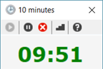
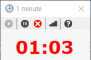

# Mob Time

Mobbing/meeting timer for Windows.

* Remains in front of (most) other windows for always-there usage.
* Choose to either count up or count down.
* Select how many minutes to target/count for.
* UI clearly shows when the timer runs over and by how much.
* Remembers the target/count duration between sessions.
* Runs in a compact window to reduce screen wastage.

---

---
